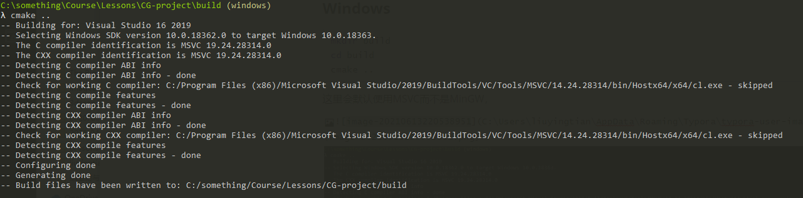

# CG-project

## Compile and Run
### MacOS

```bash
mkdir build
cd build
cmake ..
make
./lighthouse
```
### Windows
```bash
mkdir build
cd build
cmake ..
```

这里会默认使用MSVC而不是MinGW，如下图



```bash
cmake --build .
```

会在Debug文件夹下生成可执行文件

```bash
.\Debug\lighthouse.exe
```


## How to use
open http://127.0.0.1:8080/index.html

input an even number (4 <= n <= 1000) and click `generate`


